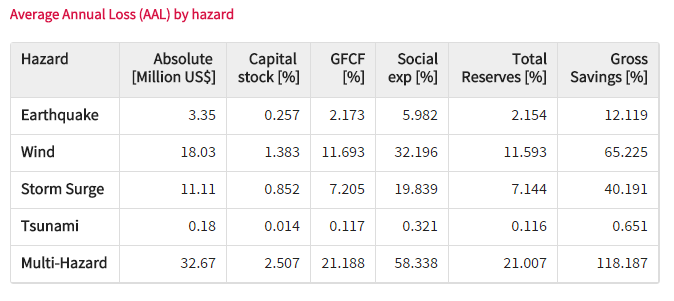

Introducing PacSAFE
===================
The PacSAFE project is a response to demand from Pacific Island Countries for tools to better understand disaster impacts. The PacSAFE software tool is designed and developed for national disaster management offices and related agencies involved in planning for, preparing for and responding to natural disasters.

The PacSAFE software tool was initially developed by the Pacific Community for urban planners to interact with hazard and asset data, such as the Pacific Catastrophe Risk Assessment and Financing Initiative (PCRAFI) asset database. PacSAFE is built upon the highly successful InaSAFE project (`http://inasafe.org <http://inasafe.org>`_) and the QGIS Geographic Information System (`http://www.qgis.org <http://www.qgis.org>`_). The underlying goal of InaSAFE is to encourage and facilitate better planning for disasters - our slogan is "better planning saves lives".

.. image:: images/100002010000057C0000039673F261A1F4F33886.png

Each country faces its own unique challenges. Based on the *Global Assessment Report for Disaster Risk Reduction*, the biggest threats in Tonga are posed by tropical cyclones and storm surge inundation. Other countries will face different challenges, and these challenges may evolve over time.

   Probabilistic risk results for Tonga. GFCF is Gross Fixed Capital Formation. Average Annual Loss is an indicator of the expected loss per year from hazards, averaged over many years. Source: GAR2015.

.. figure:: images/10000000000002AE00000156F2C6DD5A4FA21026.png

   Contribution to average annual loss from different hazards in Tonga. Source: GAR2015.

.. figure:: images/10000000000002A7000001268F8C19B2DCDC3F44.png

   Probable maximum loss for different hazards in Tonga. Source: GAR2015.

The PacSAFE project aims to provide a tool that will enhance the ability of disaster managers to prepare for and respond to disasters, and to reduce the impacts of disasters on the local population and infrastructure.

**Open source**

From the beginning, PacSAFE has been an open source project (GPL license). This means there are no licensing fees, the software can be freely copied and shared with anyone, and the source codes used to create the software are freely available which means that anyone with a little technical knowledge can contribute to the project. Being an Open Source project is important for us because we want as many people as possible to be able to use and improve the software. If 'better planning saves lives', having a tool that can be used by everyone to do better planning makes sense, right?

**Open data**

A key driving force in the ability to use tools such as PacSAFE is open access to relevant, up-to-date and well maintained geospatial data. Without roads, buildings, administrative areas, flood and population data etc., a tool like PacSAFE would be impossible to use. PCRAFI, OpenStreetMap.org, WorldPop and many government and non-government organisations around the world have been leading the effort to make such datasets available. We cannot emphasise enough the importance of government in taking a lead role in making their data freely available so that it can be used for the benefit of their citizens.
