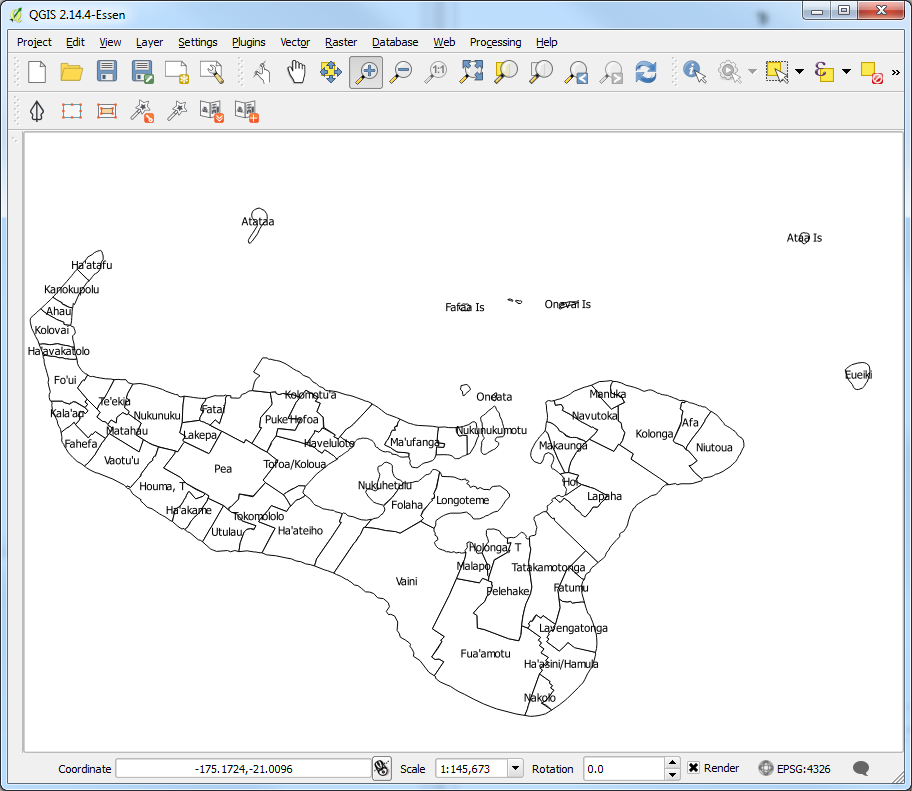
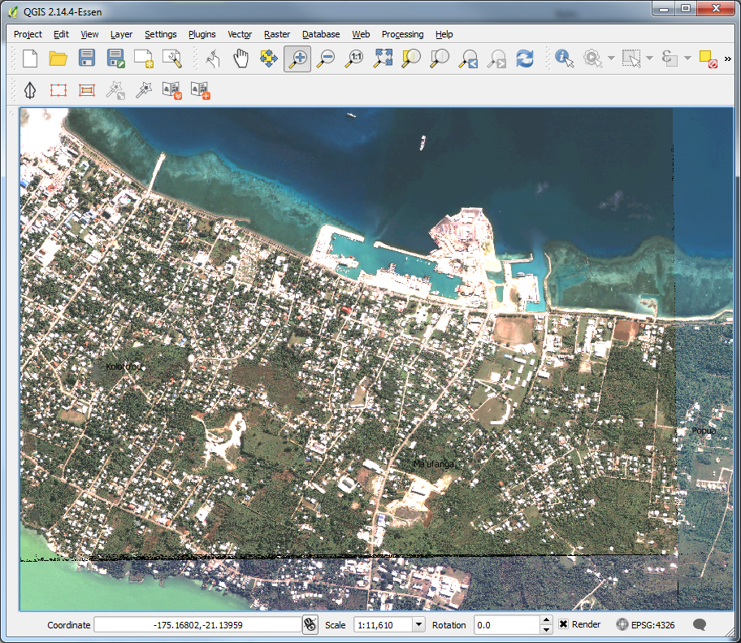

Running PacSAFE
===============

Introduction
------------

In this exercise, we will work through an example scenario where we show how the different data elements used by PacSAFE are combined in order to analyse the potential impact of a tsunami on both the buildings and population.

After we have run the PacSAFE analysis we will print the map and analysis report as a pdf and review the results. We will also learn how to change the inundation threshold and take a look at the default settings for minimum needs. We will also learn how to save our work.

Learning objective
------------------

To develop the participant's basic understanding of the InaSAFE workflow and application of InaSAFE in the Disaster Management sector. By the end of this exercise, participants will:

*   Be able to run a tsunami analysis using PacSAFE - on buildings;

*   Be able to run a tsunami analysis using PacSAFE - on population;

*   Understand the tsunami impact default settings;

*   Understand the impact summary report;

*   Be able to change the analysis threshold and run a new scenario;

*   Be able to generate a PDF map from the results of an analysis; and

*   Be able to save their work to share results with others.

Data for this exercise
++++++++++++++++++++++

The data for this exercise are packaged in the PacSAFE application. There is no need to download data to run the exercises.

.. |100002010000057C0000039673F261A1F4F33886_png| image:: images/100002010000057C0000039673F261A1F4F33886.png

.. |10000000000002A20000012DD9625173C0124347_png| image:: images/10000000000002A20000012DD9625173C0124347.png
    :width: 16cm
    :height: 7.146cm

.. |10000000000002AE00000156F2C6DD5A4FA21026_png| image:: images/10000000000002AE00000156F2C6DD5A4FA21026.png
    :width: 16cm
    :height: 7.976cm

.. |10000000000002A7000001268F8C19B2DCDC3F44_png| image:: images/10000000000002A7000001268F8C19B2DCDC3F44.png
    :width: 16cm
    :height: 6.929cm

.. |1000020100000174000001554CDAA6814BF94AB3_png| image:: images/1000020100000174000001554CDAA6814BF94AB3.png

.. |100002010000007D0000005F573048AF9A3DA6CA_png| image:: images/100002010000007D0000005F573048AF9A3DA6CA.png

.. |100000000000017B000000F871DFDD7DBF63B3C2_png| image:: images/100000000000017B000000F871DFDD7DBF63B3C2.png

.. |10000000000000AA000000AA2CAF21F3194C7C22_png| image:: images/10000000000000AA000000AA2CAF21F3194C7C22.png

.. |100002010000056A00000313CCF9848F176DC3DC_png| image:: images/100002010000056A00000313CCF9848F176DC3DC.png

.. |100002010000056B0000034B293CE5D07B3DFB82_png| image:: images/100002010000056B0000034B293CE5D07B3DFB82.png

.. |100002010000039F00000355996C0DC117FE9AD6_png| image:: images/100002010000039F00000355996C0DC117FE9AD6.png

.. |10000201000004270000021EB2807F8F2C80E98E_png| image:: images/10000201000004270000021EB2807F8F2C80E98E.png

.. |100002010000004400000044CC8C90B40B155577_png| image:: images/100002010000004400000044CC8C90B40B155577.png

.. |100002010000004400000043EAFCCD2DA5D63DDE_png| image:: images/100002010000004400000043EAFCCD2DA5D63DDE.png

.. |1000020100000043000000442857E450D7916541_png| image:: images/1000020100000043000000442857E450D7916541.png

.. |1000020100000044000000445540F66CD7333DAE_png| image:: images/1000020100000044000000445540F66CD7333DAE.png

.. |1000020100000044000000443D54B4E784144E4C_png| image:: images/1000020100000044000000443D54B4E784144E4C.png

.. |10000201000000440000004452F6510DADA0A162_png| image:: images/10000201000000440000004452F6510DADA0A162.png

.. |10000201000005860000018B95ECE8E7C303FD6B_png| image:: images/10000201000005860000018B95ECE8E7C303FD6B.png

.. |1000020100000498000004CC90E5D7823F02EB7A_png| image:: images/1000020100000498000004CC90E5D7823F02EB7A.png

.. |1000020100000568000003854B3E041BB1044C14_png| image:: images/1000020100000568000003854B3E041BB1044C14.png

.. |10000201000003AD000000CEA674FD7370360E6F_png| image:: images/10000201000003AD000000CEA674FD7370360E6F.png

.. |10000201000002E0000001C2CEDFED88A69ED83E_png| image:: images/10000201000002E0000001C2CEDFED88A69ED83E.png

